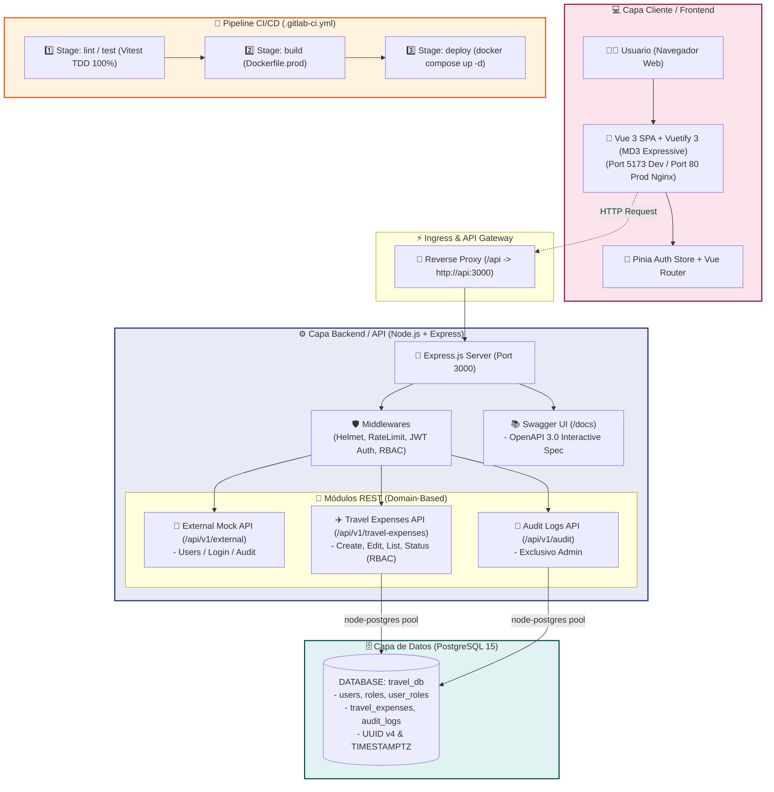

# 🧳 Sistema de Gestión de Viáticos Institucionales

[](https://gitlab.com)
[](https://www.typescriptlang.org/)
[](https://vuejs.org/)
[](https://vuetifyjs.com/)
[](https://expressjs.com/)
[](https://www.postgresql.org/)
[](https://www.docker.com/)

Plataforma full-stack modular para la tramitación, control y auditoría de solicitudes de viáticos institucionales. El sistema implementa autenticación por **JWT**, control de acceso basado en roles (**RBAC**), interfaz con la paleta de **Material Design 3 (MD3) Expressive Design**, especificación **OpenAPI 3.0 (Swagger UI)** y desarrollo guiado por pruebas (**TDD**).

---

## 🏗️ Arquitectura e Infraestructura (Diagrama Mermaid)

La arquitectura del sistema sigue una estructura de micro-servicios modularizada y contenedorizada en **Docker**, compuesta por la capa cliente de presentación web, la API Backend en Node.js Express, la base de datos relacional PostgreSQL y el pipeline de CI/CD:



---

## 🌟 Características Principales

1. **Autenticación y Seguridad Estricta:**
   - Hashing seguro de contraseñas con **Argon2id** (`$argon2id$`).
   - Tokens **JWT** con firma `jose` y expiración controlada.
   - Seguridad de cabeceras mediante **Helmet** y limitador de tasa de peticiones con **express-rate-limit**.

2. **Control de Acceso Basado en Roles (RBAC):**
   - **`requester`**: Crea viáticos, edita **únicamente sus propios viáticos** mientras estén en estado `'Draft'`, y visualiza sus solicitudes.
   - **`approver`**: Visualiza solicitudes en estado `'Submitted'` y cambia el estado a `'Approved'` o `'Rejected'`, generando un log automático de auditoría.
   - **`admin`**: Lectura global de solicitudes y acceso exclusivo a la bitácora de auditoría.

3. **Material Design 3 (MD3) Expressive Design:**
   - Paleta de color expresiva (*Deep Purple* `#6750A4`, *Primary Container* `#EADDFF`, *Tertiary Rose* `#7D5260`).
   - Componentes Glassmorphic con `backdrop-filter: blur(16px)` y esquinas redondeadas *Extra Large* (28px).
   - Estructura basada en el patrón **Smart / Dumb Components**.

4. **Documentación Swagger / OpenAPI 3.0:**
   - Documentación viva co-localizada en las rutas mediante anotaciones `@openapi` JSDoc.
   - Interfaz interactiva disponible en `http://localhost:3000/docs`.

5. **Pruebas Automatizadas (TDD):**
   - Cobertura total mediante **Vitest** y **Supertest** bajo el patrón AAA y enfoque de Caja Negra.

---

## 🛠️ Requisitos Previos

- **Docker** `>= 24.0`
- **Docker Compose** `>= 2.20`
- **Node.js** `>= 20.0` (opcional, para ejecución local sin Docker)

---

## 🚀 Guía de Inicio Rápido (Desarrollo Local)

### 1. Clonar el repositorio
```bash
git clone https://github.com/eabol/travel-management.git
cd travel-management
```

### 2. Levantar la infraestructura con Docker Compose
```bash
docker compose up --build
```
Este comando levantará 3 contenedores en desarrollo con hot-reloading:
- 🌐 **Frontend (Vue 3 + Vuetify):** `http://localhost:5173`
- ⚙️ **Backend API (Express):** `http://localhost:3000`
- 📚 **Swagger UI:** `http://localhost:3000/docs`
- 🗄️ **PostgreSQL Database:** `localhost:5432` (`user: postgres`, `password: postgres`, `db: travel_db`)

---

## 🔑 Credenciales Semilla por Defecto (Seed Data)

Todos los usuarios semilla están inicializados con la clave: **`AdminPassword123!`**

| Rol | Correo Electrónico | Descripción de Permisos |
| :--- | :--- | :--- |
| **`admin`** | `admin@institution.gob.ec` | Acceso global y bitácora de auditoría. |
| **`requester`** | `requester@institution.gob.ec` | Creación y edición de viáticos propios en borrador. |
| **`approver`** | `approver@institution.gob.ec` | Revisión y aprobación/rechazo de solicitudes enviadas. |

---

## 🧪 Ejecución de Pruebas Unitarias e Integración (TDD)

### Pruebas del Backend (19 Tests)
```bash
docker compose exec api npm run test:run
```

### Pruebas del Frontend (7 Tests)
```bash
docker compose exec web npm run test:unit -- --run
```

---

## 📂 Colección de Postman

Se incluye el archivo oficial de colección **Postman v2.1.0** para probar todos los endpoints del sistema:
- Path: [`docs/postman_collection.json`](file:///home/eabol/coding/travel-management/docs/postman_collection.json)

---

## 📜 Registros de Decisiones de Arquitectura (ADRs)

Todas las decisiones clave del proyecto están respaldadas por documentos ADR en [`docs/adrs/`](file:///home/eabol/coding/travel-management/docs/adrs):
- [`ADR 001: Estrategia de Orquestación Docker Multientorno`](file:///home/eabol/coding/travel-management/docs/adrs/001-docker-multi-environment-strategy.md)
- [`ADR 002: Estándar de Código y Base de Datos en Inglés`](file:///home/eabol/coding/travel-management/docs/adrs/002-database-schema-english-standard.md)
- [`ADR 003: Adopción del Sistema Material Design 3 (MD3) Expressive Design`](file:///home/eabol/coding/travel-management/docs/adrs/003-frontend-md3-expressive-design.md)
- [`ADR 004: Documentación API con OpenAPI 3.0 y Swagger UI`](file:///home/eabol/coding/travel-management/docs/adrs/004-openapi-swagger-integration.md)
- [`ADR 005: Configuración del Pipeline GitLab CI/CD`](file:///home/eabol/coding/travel-management/docs/adrs/005-gitlab-ci-cd-pipeline.md)

---

## 📄 Licencia

Este proyecto está bajo la Licencia MIT.
